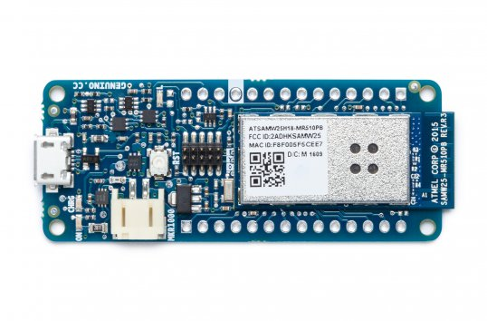

The Arduino MKR1000 is one of the latest wi-fi boards by Arduino. It is designed for IoT projects and can run on battery power using a Li-Po battery or on external 5V, charging the battery while running on external power.

It provides low power wi-fi, a large number of Analog and Digital pins and has a compact format to fit in any IoT project.

This Arduino can be used with the Arduino IDE but the setup requires a little bit more steps as the wi-fi network needs to be configured.

In this tutorial, we're gonna work on a basic app to control the built-in LED of the **Arduino** in **Node.js** using the **Johnny-Five** framework.

If you want to follow along, you can find the code on my [github repo](https://github.com/charliegerard/arduino-projects/tree/master/arduino-mkr1000).

### Step 1: Setting up the wi-fi on the Arduino

* Plug your Arduino to your computer.
* Open the Arduino IDE.

Once the Arduino IDE is launched, it may prompt you to install the correct package to use with the Arduino MKR1000. If not, follow these steps:

* Go to `Tools > Board > Boards Manager` and search for `Arduino SAMD Boards` and install the package.

* Once this is done, go to `File > Examples > Firmata` and open the `StandardFirmataWifi` sketch.

* Have a look at the `wifiConfig.h` file and update your network configurations:
  * Uncomment the line that says `#define WIFI_101`
  * Scroll down and find the line that says `char ssid=[] "your network name"` and replace the string with the name of your wi-fi network.
  * Scroll down and find the line that says `char wpa_passphrase[] = "your_wpa_passphrase";` and edit your wi-fi password.

* Next, check that your sketch compiles properly by clicking on the **Verify** button.
* Upload it to the board:
  * Make sure your board is selected by going to `Tools > Board` and select the Arduino MKR1000.
  * Select the right port by going to `Tools > Port` and select either `/dev/cu.usbmodem1` or `/dev/cu.usbmodem1411`.
  * Click on the upload button.

Once your wi-fi is configured on the board, let's create a basic Node.js app to blink the built-in LED of the Arduino.

### Step 2: Setting up the Node.js app

If you've never built a Node.js app before, have a look at the [Node.js website](https://nodejs.org/en/) and follow the simple instructions.
Once you have Node installed, you will also need the [Johnny-Five framework](http://johnny-five.io/).

If you're already familiar with Johnny-five, you'd expect to have a simple file like this:


var five = require('johnny-five');
var board = new five.Board();

board.on("ready", function(){
  console.log("MKR1000 is ready");

  var led = new five.Led(6);
  led.blink(500);
})


But for some reason, this doesn't work for me and I get a timeout error...

**However, there is another solution that works!** \0/

### Extra steps:

Go back to the Arduino IDE, create a new sketch and copy/paste the following code:


#include <SPI.h>
#include <WiFi101.h>

char ssid[] = "your-network-name";      //  your network SSID (name)
char pass[] = "your-network-password";   // your network password
int keyIndex = 0;                 // your network key Index number (needed only for WEP)

int status = WL_IDLE_STATUS;
WiFiServer server(80);

void setup() {
  Serial.begin(9600);      // initialize serial communication
  pinMode(9, OUTPUT);      // set the LED pin mode

  // check for the presence of the shield:
  if (WiFi.status() == WL_NO_SHIELD) {
    Serial.println("WiFi shield not present");
    while (true);       // don't continue
  }

  // attempt to connect to Wifi network:
  while ( status != WL_CONNECTED) {
    Serial.print("Attempting to connect to Network named: ");
    Serial.println(ssid);                   // print the network name (SSID);

    // Connect to WPA/WPA2 network. Change this line if using open or WEP network:
    status = WiFi.begin(ssid, pass);
    // wait 10 seconds for connection:
    delay(10000);
  }
  server.begin();                           // start the web server on port 80
  printWifiStatus();                        // you're connected now, so print out the status
}

void loop() {
  WiFiClient client = server.available();   // listen for incoming clients

  if (client) {                             // if you get a client,
    Serial.println("new client");           // print a message out the serial port
    String currentLine = "";                // make a String to hold incoming data from the client
    while (client.connected()) {            // loop while the client's connected
      if (client.available()) {             // if there's bytes to read from the client,
        char c = client.read();             // read a byte, then
        Serial.write(c);                    // print it out the serial monitor
        if (c == '\n') {                    // if the byte is a newline character

          // if the current line is blank, you got two newline characters in a row.
          // that's the end of the client HTTP request, so send a response:
          if (currentLine.length() == 0) {
            // HTTP headers always start with a response code (e.g. HTTP/1.1 200 OK)
            // and a content-type so the client knows what's coming, then a blank line:
            client.println("HTTP/1.1 200 OK");
            client.println("Content-type:text/html");
            client.println();

            // the content of the HTTP response follows the header:
            client.print("Click <a href=\"/H\">here</a> turn the LED on pin 9 on");
            client.print("Click <a href=\"/L\">here</a> turn the LED on pin 9 off");

            // The HTTP response ends with another blank line:
            client.println();
            // break out of the while loop:
            break;
          }
          else {      // if you got a newline, then clear currentLine:
            currentLine = "";
          }
        }
        else if (c != '\r') {    // if you got anything else but a carriage return character,
          currentLine += c;      // add it to the end of the currentLine
        }

        // Check to see if the client request was "GET /H" or "GET /L":
        if (currentLine.endsWith("GET /H")) {
          digitalWrite(9, HIGH);               // GET /H turns the LED on
        }
        if (currentLine.endsWith("GET /L")) {
          digitalWrite(9, LOW);                // GET /L turns the LED off
        }
      }
    }
    // close the connection:
    client.stop();
    Serial.println("client disonnected");
  }
}

void printWifiStatus() {
  // print the SSID of the network you're attached to:
  Serial.print("SSID: ");
  Serial.println(WiFi.SSID());

  // print your WiFi shield's IP address:
  IPAddress ip = WiFi.localIP();
  Serial.print("IP Address: ");
  Serial.println(ip);

  // print the received signal strength:
  long rssi = WiFi.RSSI();
  Serial.print("signal strength (RSSI):");
  Serial.print(rssi);
  Serial.println(" dBm");
  // print where to go in a browser:
  Serial.print("To see this page in action, open a browser to http://");
  Serial.println(ip);
}



**Change the SSID and password** at the beginning of the file and upload the sketch to the Arduino.

Once it's uploaded, open the Serial Monitor and **make sure it is set to 9600 BAUD**. After a few seconds, it should print out the Arduino's IP address. Copy it and keep it somewhere because we're going to need it soon.

Make sure you re-upload the **StandardFirmataWifi** sketch to your Arduino before switching back to your Node.js app.

To get the Arduino MKR1000 working with Johnny-five, we're going to need the `etherport-client` module, so, in your terminal, run `npm install etherport-client --save`.

Then, we just need to require this module and set it up with the IP address and port of the Arduino, like this:



var EtherPortClient = require("etherport-client").EtherPortClient;
var five = require('johnny-five');

var board = new five.Board({
  port: new EtherPortClient({
    host: "192.168.43.36", //Your IP goes here
    port: 3030
  }),
  timeout: 1e5,
  repl: false
});

board.on("ready", function() {
  console.log("READY!");
  var led = new five.Led(6);
  led.blink(500);
});



And you should see the Arduino's built-in LED blink! :)
Now you can add more components and build more interesting projects using the Arduino MKR1000 and Johnny-five!
